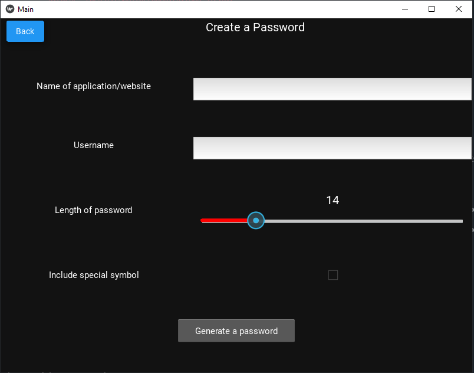

# Password Manager

Introducing a password management solution designed to simplify and secure your digital life. This robust password manager offers a complete suite of features to help you take control of your online credentials.

- Store your login details 💾
- Generate strong and unique passwords 🔐
- View your saved credentials 👁️
- Seamless import functionality 📥
- Export feature to backup credentials 📤
- Display login details needed 🖥️

## Installation Guide
1. Run install.bat(Windows) / install.sh(Unix)
2. Make sure python is installed 
3. Run the following command and the application will start
```
python src/main.py
```
## Functionalities

### Login Details Storage


<p>Users can store their login details by providing the following information</p>

1. Website/software name
2. Username
3. Password

### Password Generation



<p>The software provides the following configurations when generating a password</p>

1. Length of the password
2. Include/exclude the usage of special symbols (For example: !@#$%* etc)

### Login Details Import
<p>Users have the ability to import login details that is in the form of a text file, to the software</p>
<p>CAUTION: The login details must be in the following format or it will not work as intended.</p>

#### Import file format
Website: WEBSITENAME1 Username: USERNAME1 Password: Password1

Website: WEBSITENAME2 Username: USERNAME2 Password: Password2

Website: WEBSITENAME3 Username: USERNAME3 Password: Password3


### Login Details Export
<p>If the user desired to export their login details, the software would be able to convert all the login details stored(locally) to a text file.
The login details will be exported in the format shown below</p>

Website: WEBSITENAME1 Username: USERNAME1 Password: Password1

Website: WEBSITENAME2 Username: USERNAME2 Password: Password2

Website: WEBSITENAME3 Username: USERNAME3 Password: Password3

## TODO